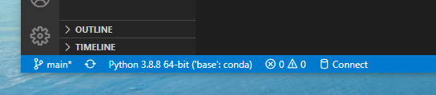

# SQLITE, PANDAS AND PYTHON

## About

This repo is used with SQLite and pandas with Python to see how I like using the libraries. 

One of my many hobbies is knitting, so this database is making an inventory of yarns I own. I sometimes crochet, so I added crochet gauges in the database as well. 

## Running the Program

### Libraries:
1. It is highly recommended to use Anaconda:
   * Anaconda is a "free, easy-to-install package manager, environment manager, and Python distribution."
   * Works on Windows, macOS and Linux.
   * Python, SQLite and pandas are all included.
   * [Click here](https://docs.anaconda.com/anaconda/) to download or view docs.
2. If you do not wish to use Anaconda and download separately:
   * Download [Python](https://www.python.org/downloads/). 
   * Download [SQLite](https://www.sqlite.org/download.html). 
     * Should be built into Python, but link included if needed. 
   * Install [pandas](https://pandas.pydata.org/pandas-docs/stable/getting_started/index.html#getting-started).

Note: Make sure you select the Python Interpreter in your IDE.

### Steps

1. Clone the repo.
2. Open in your editor.
3. Open `database.py`.
4. Most of the code is commented out. 
	* Section by section, uncomment the code, run the program, then re-comment the previous section before moving to the next.
	* Leave the code at the top and bottom uncommented and running every time.

